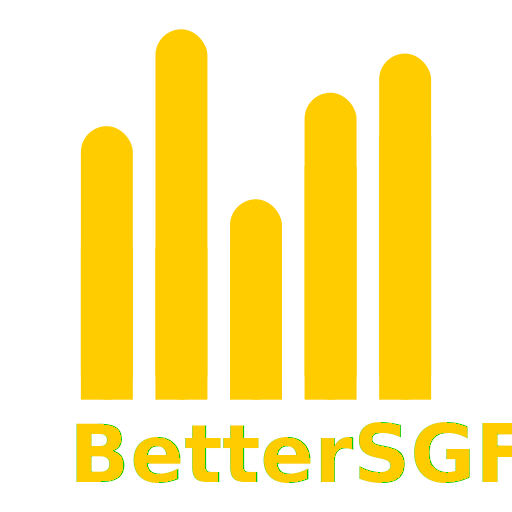

  

  <a href="https://better-sgf.de"  target=”_blank” rel=”noopener noreferrer”>App</a> -
  <a href="https://api.better-sgf.de/events.json"  target=”_blank” rel=”noopener noreferrer”>Data</a>

# BetterSGF

**DISCLAIMER:** Yes, I know the code has a lot of room for improvements, it was not written in mind of being shared with others and will be improved over time.

## Why did I built this?

Looking at the schedule for this years Schlossgrabenfest in Darmstadt, I noticed that it lacks certain features for filtering and ordering content. This is why I wrote my own little tool, which hopefully makes this process easier. In addition, this app comes as a PWA with offline functionality, which could come in handy since cellular services tend to be overloaded during the event.

## How does this work?

The app basicaly consists of two parts:

- **Crawler:** Parses the information from official Schlossgrabenfest sources and renders them as structured JSON content. The content is then meant to be deployed to a static file hosting service.
- **Frontend:** Fetches the parsed data from the hosting service and renders it to the end user.

Both parts are designed to be built in a CI pipeline and deployed as static content. The crawler is meant to be run in regular but not to intense cycles, to keep load off the official sources but update the information regularly.
